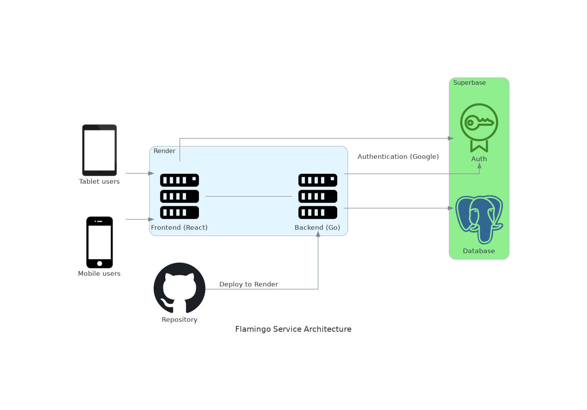

# Framingo Armond
🔥Tinder like Flashcard App. 


# Architecture
- **Render** (Static site for React, GraphQL service)
- **Superbase** (Database and authentication)
  


# Environment
This repository is structured as a mono repository. 

| Directroy | Discription |
|:--|:--|
|frontend | Frontend implementation |
|backend| Backend GraphQL API server |

## frontend
- Typescript
- React
- Vite

## backend
- Go
- Echo
- gqlgen (GraphQL)
  
# Run Locally
```
make server
```