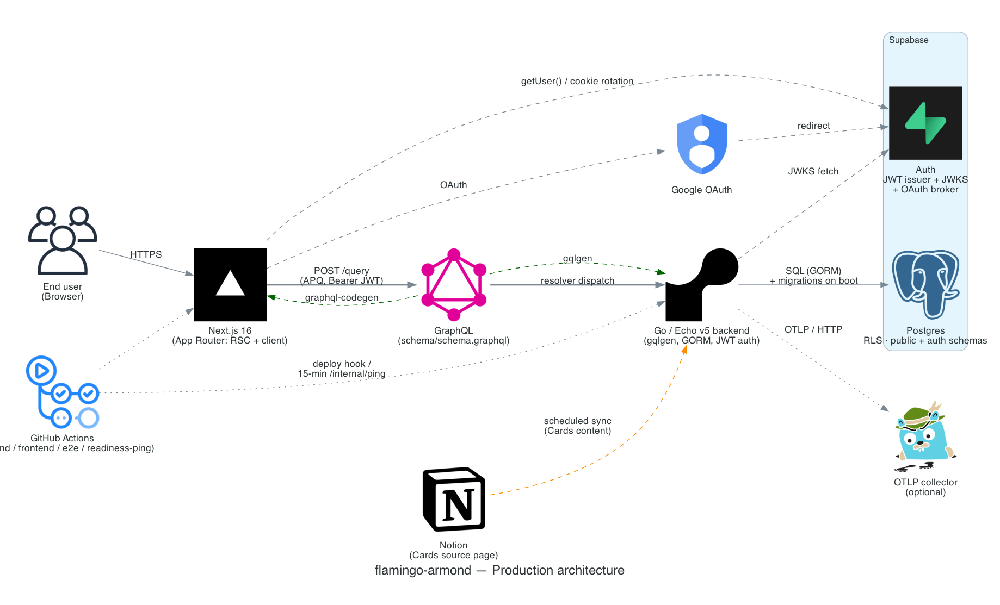

# Flamingo Armond

[](https://github.com/yasuflatland-lf/flamingo-armond/actions/workflows/backend.yml)
[](https://github.com/yasuflatland-lf/flamingo-armond/actions/workflows/frontend.yml)
[](https://codecov.io/gh/yasuflatland-lf/flamingo-armond)
[](https://codecov.io/gh/yasuflatland-lf/flamingo-armond)

🦩 Swiping Flashcard app — a Go (Echo) backend, a Next.js 16 frontend, and a shared GraphQL schema, with Supabase for Postgres + Auth.

## Architecture



## Quick Start

### 1. Prerequisites

| Tool | Why | How to install |
|---|---|---|
| **mise** | Pins Go, Node, pnpm, and the Supabase CLI to the versions in `.tool-versions` files | `curl https://mise.run \| sh` |
| **Docker** | Backs `supabase start` (Postgres + Auth running locally) | Docker Desktop / OrbStack / colima |

Do not install pnpm via `npm i -g pnpm` or `brew install pnpm` — a PATH-level binary shadows the mise shim and silently breaks version pinning. See `docs/dev-setup.md` § "Tools".

### 2. Initial setup

With Docker running:

```bash
make setup
# → check-docker → mise install → pnpm install → supabase start → sync-env → check-google-oauth
```

The **only manual step** is editing `./.env` to add Google OAuth client credentials. `frontend/.env.local` and `backend/.env.local` are auto-generated and re-running `make setup` is safe. Full procedure (Cloud Console steps, `127.0.0.1`-vs-`localhost` rule) in `docs/dev-setup.md` § "Supabase CLI".

### 3. Run locally

```bash
make dev-backend     # Go server on http://127.0.0.1:1323
make dev-frontend    # Next.js dev server on http://127.0.0.1:3000
```

Sign in via `http://127.0.0.1:3000/login` (Google) → land on `/profile`. Use **`127.0.0.1`**, not `localhost` — Google OAuth treats them as distinct origins.

### 4. Production deployment

Production runs across Supabase (Postgres + Auth), Render (Go backend), and Vercel (Next.js frontend), provisioned manually through each provider's dashboard. Full checklist in `docs/deployment.md`; `make setup-prod` wraps it with prerequisite checks and smoke tests.

## Setup For Production

`make setup-prod` is a guided wrapper around the manual `docs/deployment.md` runbook: it validates Supabase / Render / Vercel / GitHub tokens, hands off to the provider dashboards, and runs smoke tests once each service is up. Prerequisites (PATs, Google OAuth client, GitHub App installations) and the env var matrix live in `docs/deployment.md`.

```bash
make setup-prod-preflight   # validate tokens & GitHub App installations only (unattended)
make setup-prod             # full guided bring-up
make setup-prod-postapply   # re-run first Render deploy + smoke tests from .state.yml
```

`make teardown-prod` is the destructive inverse — only use it on environments created by `setup-prod`.

## Makefile reference

| Target | What it does |
|---|---|
| `make setup` | One-shot first-time local setup |
| `make sync-env` | Idempotent env sync from `supabase status -o env` |
| `make supabase-restart` | Re-boot Supabase to pick up `./.env` edits |
| `make dev-backend` | Start the Go / Echo backend on port 1323 |
| `make dev-frontend` | Start the Next.js 16 dev server on port 3000 |
| `make codegen` | Regenerate GraphQL bindings on both sides from `schema/*.graphql` |
| `make test` | Run backend Go tests (race + coverage) and frontend Vitest suite |
| `make setup-prod` | Guided production bring-up across Supabase + Render + Vercel (see § "Setup For Production") |

`make dev-backend` / `make dev-frontend` are foreground processes — run them in separate terminals. `make codegen` is required after editing `schema/*.graphql` (generated outputs are gitignored). `make test` mirrors CI.

## Repository layout

```
backend/            Go / Echo backend (the only end-to-end-wired surface today)
frontend/           Next.js 16 App Router frontend
schema/             Shared GraphQL schema (source of truth for both codegen tools)
docs/               L2 architecture & topic docs
.claude/rules/      L3 cross-cutting conventions
```

Project-wide guidance for AI assistants lives in `CLAUDE.md`.
