# Backend of Flamingo Armond

Backend server implementation for Flamingo Armond by Go.

## Flashcard Algorithm

```mermaid
stateDiagram-v2
    direction LR
    state StateCheck <<choice>>
    StateCheck: When swiping, is there any swipe information?
    NotExist: No
    Exist: Yes

    %% NotExist
    StateCheck --> NotExist: Save swipe information
    NotExistTask: Show the card with the oldest update time and the one that is either unknown or unanswered
    NotExist --> NotExistTask
    NotExistTask --> StateCheck

    %% Exist
    StateCheck --> Exist: Save swipe information

    Exist --> Difficult: If the last 5 swipes are consecutively unknown
    Exist --> Good: If 5 out of the last 10 swipes are known
    Exist --> Easy: If the last 5 swipes are consecutively known
    Exist --> InWhile: If none of the above apply, and it’s been a while since the last time
    Exist --> Def2: If none of the above apply

    ChgState: Change user state
    Def2: Default

    Difficult --> ChgState: Display y words that are likely known
    note right of Difficult : Randomly select words added in the last week
    Good --> ChgState: Display using the standard algorithm
    note right of Good: Implemented with Spaced Repetition.
    Easy --> ChgState: Randomly display from the unknown word bucket
    note right of Easy : Randomly select the oldest word without an "learned" flag and that hasn't been updated
    InWhile --> ChgState: Start with about 5 known words
    note right of InWhile : Randomly select words that have been recently updated and don't have a "learned" flag
    Def2 --> ChgState: Start randomly with recently added words.

    ReturnCards: Return a list of cards to be processed on the front-end in batches of around 10 until the next request.
    ChgState --> ReturnCards
    ReturnCards --> StateCheck
```



# Precondition

- Go 1.22.5
- Echo v4.12.0
- Gorm v1.25.10 (ORM)
- Goose v3 (Data migration)
- gqlgen v0.17.49 (GraphQL code generator and framework)

# Set up

## Install Goose

```
go install github.com/pressly/goose/v3/cmd/goose@latest
```

## Install libraries

```
go install
```

## Create `.env`

Copy `.env.example` and create `.env`.

| Keys           | Discription                                |
|:---------------|:-------------------------------------------|
| PORT           | Application Port                           | 
| GO_ENV         | Application environment. Dev or Production | 
| GQL_COMPLEXITY | GraphQL Complexity                         |
| PG_HOST        | Postgres Host name                         |
| PG_USER        | Database User                              |
| PG_PASSWORD    | Database Password                          |
| PG_DBNAME      | Database Name                              |
| PG_PORT        | Postgres Port                              |
| PG_SSLMODE     | SSL Mode of Postgres                       

# Test

## How to Run All Tests

```
go clean -testcache
go test -v ./...
```

# How to run Locally

At the root directory, run

```
docker compose up --build
```

# Generators

This backend uses some generated code. Here are the steps to generate code.

## Generate GraphQL

1. Revise table schemas under `/backend/db/migrations`
1. Revise GraphQL Schemas in `/backend/graph/schema.graphqls` accordingly.
1. At `/backend`, run `make gen`. It will generate `generated.go`, `resolver.go` and `schema.resolvers.go` accordingly.

## Generate Parser for Loading Flashcards' Texts

1. Revise `/backend/pkg/notion/parser.y`
2. At `/backend`, run `make parsergen`

# Tips

## How to generate GraphQL Model under /graph/model

Right under the root, run below.

```
 go run ./cmd/gqlgenerate
```

## How to see the Make Commands

```
make help
```

## How to test the production database connection.
There is a smoke test to connect to the production database in `main_test.go`
```
go test -run "Test with Production Database"
```

## How to Install goyacc

1. Run `go install golang.org/x/tools/cmd/goyacc@latest`
2. Set below in your shell initlizier. For example, if it's `.zshrc`, add below.
    ```azure
    export PATH=$PATH:$(go env GOPATH)/bin
    ```

## How to Access the Docker Image

Run `docker images` and get `IMAGE ID`

```
 docker run -it <IMAGE ID> /bin/sh  
```

## Postgres SQL utilities

### Show the list of databases

```
SELECT datname FROM pg_database;
```

### Show users of the database

```
SELECT usename FROM pg_catalog.pg_user;
```
