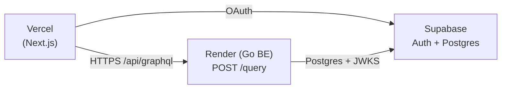

# Production deployment

Manual bring-up guide for the production stack. Walk through this once when standing up a new environment from scratch; everyday redeploys (push to `main`) do not require these steps.

The stack splits across three providers, each owning a distinct concern:

| Provider | Owns |
|---|---|
| Supabase | Postgres + Auth (JWT issuer, JWKS) |
| Render | Go / Echo backend (`backend/`) |
| Vercel | Next.js frontend (`frontend/`) |

## Guided bring-up via `make setup-prod`

A thin Ansible-driven layer wraps this manual runbook with prerequisite checks, value-derivation, GitHub Secret registration, deploy-trigger, and smoke tests. It does **not** replace the dashboard work below — operators still create the Supabase project, the Render web service, and the Vercel project by hand. The remainder of this document is the authoritative manual procedure; refer to it for what each phase is doing under the hood.

```bash
make setup-prod              # full guided run: preflight + 4 dashboard steps + smoke + hook
make setup-prod-preflight    # ~10s scanner: tokens + auth + manual-prereq reminders
make setup-prod-postapply    # re-runnable: kick first Render deploy + smoke tests
make supabase-hooks          # re-runnable: enable custom_access_token hook (standalone)
```

### Why guided, not fully automated

The earlier Terraform implementation was deleted **as an intentional IaC-abandonment decision**, not as tech-debt cleanup — the bring-up runs once per environment per lifetime, so the ROI of full API automation is low and the maintenance cost of mirroring three providers' APIs in a stateful tool is high. The playbook re-introduces the layer where humans actually make mistakes (token expiry, missed GitHub App installs, copy-paste of derived URLs, forgetting to register the deploy-hook secret) without re-introducing IaC. Reach for `--tags <phase>` or hand-runs of the manual procedure when you need to deviate; the playbook is a convenience, not a contract.

### Make targets and phases

The Makefile exposes `setup-prod`, `setup-prod-preflight`, `setup-prod-postapply`, and `supabase-hooks`. The four dashboard phases (`supabase`, `render`, `vercel`, `loopback`) must run in order; giving each its own target invites order-of-operation mistakes, so partial runs are driven via `--tags` directly:

```bash
ansible-playbook playbooks/setup-prod.yml --tags <phase>
```

| Tag | Phase | Runbook step |
|---|---|---|
| `preflight` | 1 | (pre-bring-up scanner) |
| `supabase` | 2 | Step 1 — Supabase project create |
| `render` | 3 | Step 2 — Render web service |
| `vercel` | 4 | Step 3 — Vercel project import |
| `loopback` | 5 | Step 4 — Supabase loopback |
| `postapply` | 6 | Post-bring-up + smoke |
| `supabase-hooks` | 7 | Enable custom_access_token hook via Management API |

`supabase.yml` is imported twice from the entry playbook with different `step` vars (`create` vs `loopback`), gated by `when: step == ...` blocks inside the file. This keeps the tag → step mapping 1:1 (`--tags supabase` runs only Step 1, `--tags loopback` only Step 4) while avoiding two near-duplicate task files.

### State file (`.setup-prod.state.yml`)

The playbook persists collected values across phases in a YAML file at the repo root. It is **gitignored**, written with mode `0600`, and treated as a single-operator local artifact:

| Property | Value |
|---|---|
| Path | `<repo-root>/.setup-prod.state.yml` |
| Permissions | `0600` (re-asserted on every write) |
| Backup | `<file>.<pid>.<timestamp>~` siblings created on every write (`copy: backup: yes`). Mode bits are preserved from the source (already `0600`). |
| Vault | Not encrypted; gitignore + `0600` is the baseline |
| Tier 1 secrets | `supabase_db_url` (DB password embedded) and `ping_token` (bearer token for `/internal/ping`). Do not share, copy across machines, or print on screen-share. |
| Tier 2 publishable | `supabase_anon_key`. Safe to display on the operator's own screen. |
| Tier 3 IDs / URLs | `supabase_project_ref`, `*_url`, `render_service_id`, `vercel_project_id`, `production_url`, `backend_url`. Public values, used as `--tags <phase>` re-run inputs. |
| Out-of-state | API tokens (read from env each run) and the Render deploy-hook URL (consumed once via `gh secret set`, never persisted). |

Every phase that needs prior values follows a three-step idiom: `stat:` to detect first-run vs existing file → `include_vars` only when the file exists (so YAML parse errors fail loudly instead of being masked as "missing keys") → `assert:` to enforce the keys this phase actually needs → merge new values via `combine` and re-write with `mode: '0600'`. If the file is corrupted or hand-edited, restore from the most recent backup with `cp "$(ls -1t .setup-prod.state.yml.*~ 2>/dev/null | head -1)" .setup-prod.state.yml` from the repo root.

### Why most phases reject `confirm=true`

`confirm=true` is the unattended-mode flag (intended for CI / scripted re-runs). Phases 2, 3, 4, and 5 all `fail` immediately when `confirm=true` is set, because each requires the operator to paste back values from a dashboard the playbook cannot read (project ref / anon key / DSN / service ID / deploy-hook / project ID / production URL / OAuth redirect URI). Failing fast with a clear message beats hanging on a `pause:` prompt that no one will answer. Phases 1 (preflight) and 6 (postapply) are the only fully unattended phases: postapply re-runs are how operators recover from a transient Render or Vercel cold-start smoke failure.

### External side effects

The playbook writes outside the operator's machine in five places: (1) `gh secret set RENDER_DEPLOY_HOOK_URL` on the GitHub repo (Phase 3, idempotent overwrite), (2) `gh secret set PING_TOKEN`, `gh secret set RENDER_PING_URL`, and `gh secret set VERCEL_PING_URL` on the GitHub repo (Phase 6, idempotent overwrite), (3) `PUT /v1/services/<id>/env-vars/<key>` against the Render API for dynamic env vars including `PING_TOKEN` (Phase 6), (4) `POST /v1/services/<id>/deploys` against the Render API (each call enqueues a deploy, which is the operator's intent), and (5) the local state file. Re-running any phase is safe — none of the writes accumulate state in a way that corrupts the next run.

### Three security patterns worth knowing

- **`gh secret set` via `shell:` with `stdin:`, not `--body "<URL>"`.** `--body` puts the secret on argv, where it leaks to `ps`, audit logs, and shell history. Ansible's `no_log: true` masks playbook output but does not affect argv, so piping the value through stdin is the only way to keep the deploy-hook URL out of process listings.
- **Tier-1 values are never `debug:`-printed inline with non-secret values.** `SUPABASE_DB_URL` (which carries the DB password) is shown in its own task with a "leave screen-share before reading this" warning banner, so the operator can pause sharing for that one paste.
- **CLI tools that auto-read tokens from env should be invoked without explicit token flags.** Passing a secret as `--token <value>` exposes it on argv, which is visible in `/proc/<pid>/cmdline` to other processes on the same runner and in `set -x` debug output — the same argv-leak failure mode as the `gh secret set --body` case above. Prefer env-var injection (`env:` block in workflows, exported vars in shells) over CLI flags whenever the tool supports it.

### Render deploy polling: terminal failure states

Phase 6 polls the Render deploy with `until:` over a single condition list: HTTP `[401, 403, 404]` (auth / wrong service id) plus the Render deploy state set `[live, build_failed, update_failed, canceled, deactivated, pre_deploy_failed]`. The `until` predicate (not `failed_when`) is what actually aborts the loop — `failed_when` only sets the final task status after retries exhaust, so terminal conditions must live inside `until` itself. Without all six failure states in the predicate, a doomed deploy burns the full 15-minute retry budget before the playbook gives up. If you ever change the polling logic, keep this set complete — Render's API can return any of the above as a final state, and only `live` is success.

### Failure recovery

| Failure | Surfaces in | Recovery |
|---|---|---|
| Token missing or expired | Phase 1 `assert:` or `uri:` 401 | Update `.env`, re-run `make setup-prod-preflight` |
| GitHub App not installed | Phase 3 (Render) or Phase 4 (Vercel) API failure | Install via https://github.com/apps/render or /apps/vercel, re-run the failing phase |
| Wrong Supabase pooler tab (transaction vs session) | Phase 2 DSN `assert:` | Re-copy from **Connect → Session pooler** |
| Render deploy hits a terminal failure state | Phase 6 polling abort | Fix the underlying issue (logs in Render dashboard), re-run `make setup-prod-postapply` |
| Vercel HEAD never reaches 200 | Phase 6 retry exhaustion | Open the Vercel deploy whose id Phase 6 printed (`Vercel deploy kicked: <id>`). If `BUILDING`, wait and re-run `make setup-prod-postapply`. If `ERROR`, inspect the build log — most often a missing env var (re-run `--tags vercel`). If `main` is empty, push a commit first |
| State file corrupted | `include_vars` parse error | Restore from the most recent `.setup-prod.state.yml.<timestamp>~` backup (e.g. `cp "$(ls -1t .setup-prod.state.yml.*~ \| head -1)" .setup-prod.state.yml`) |
| Need to redo a single phase | — | `ansible-playbook playbooks/setup-prod.yml --tags <phase>` (state file carries forward) |

## Topology



The browser only ever talks to its own Vercel origin. `frontend/next.config.ts` rewrites `/api/graphql` → `${BACKEND_URL}/query`, so requests reach Render through Next's rewrite — there is no CORS layer on the backend (see [`docs/frontend/backend-rewrite-contract.md`](frontend/backend-rewrite-contract.md)).

The backend trusts Supabase as the JWT issuer: it fetches the JWKS at boot from `SUPABASE_JWKS_URL` and validates `aud` / `iss` against `SUPABASE_JWT_AUDIENCE` / `SUPABASE_JWT_ISSUER` (see [`docs/backend-auth.md` § "Authentication"](backend-auth.md#authentication)). Supabase is therefore the single trust anchor between Vercel and Render.

## Manual prerequisites

A few things must be set up out-of-band before standing up the providers.

### 1. Render GitHub App installation

Render needs read access to the repository:

1. `https://dashboard.render.com/select-repo` → **Configure account**.
2. Choose the GitHub account / org owning `yasuflatland-lf/flamingo-armond`.
3. Either grant access to all repos or just this one.
4. Confirm.

If you skip this, creating the Render web service fails with a 4xx because the GitHub App cannot reach the repo.

### 2. Vercel GitHub App installation

Same idea on Vercel:

1. `https://vercel.com/new` → **Import Git Repository**.
2. If `yasuflatland-lf` is not listed, click **Adjust GitHub App Permissions** and grant access.
3. Cancel the import wizard if you only need to install the app — you will trigger the actual import in Step 3 below.

### 3. Google Cloud Console OAuth Client

Supabase delegates Google sign-in to a Google OAuth client. It must be created on the Google Cloud side. This client is **separate from the local-dev OAuth client** in `docs/dev-setup.md` § "Supabase CLI": local credentials live in the root `./.env` (the single hand-edited file; see `README.md` § env layout), production credentials live on the Google client itself, so a leaked local secret never affects production.

1. Open `https://console.cloud.google.com/apis/credentials`. Pick or create a project (this is the Google Cloud project, distinct from the Supabase project).
2. **Configure OAuth consent screen** if not yet done. Type **External**. Set product name and support email.
3. **Create Credentials → OAuth client ID** → Application type **Web application**. Name something like `flamingo-armond-prod`.
4. **Authorized redirect URIs** — add a placeholder for now:

   ```
   https://placeholder.supabase.co/auth/v1/callback
   ```

   The real Supabase project ref is unknown until the Supabase project is created in Step 1 below. After that, replace the placeholder with the actual ref (see "Post-bring-up tasks").
5. **Create**. Copy the Client ID and secret — you will paste them into Supabase Auth in the next section.

## Bring-up procedure

Four steps across the three providers. Allow about 30 minutes total; Supabase project provisioning is the slow leg (~5–15 minutes).

### Step 1 — Supabase

1. Create a new Supabase project (record region and DB password). Region matters for latency — keep it close to the Render region (the local default elsewhere in this repo is `ap-northeast-1`).
2. **Authentication → Sign In / Up**: enable Google OAuth. Paste the Client ID and secret from Manual prerequisites § 3.
3. Capture the values that other providers need:

   | Used as | Value | Where to find it in the dashboard |
   |---|---|---|
   | Frontend `NEXT_PUBLIC_SUPABASE_URL` | `https://<project-ref>.supabase.co` | **Data API** page, or assemble from **General → Project ID**. |
   | Frontend `NEXT_PUBLIC_SUPABASE_ANON_KEY` | Publishable key (preferred) or legacy anon key | **API Keys → Publishable and secret API keys** tab → **Publishable key** `default` row. **Never** copy from **Secret keys** or the legacy `service_role` row. |
   | Backend `SUPABASE_JWKS_URL` | `https://<project-ref>.supabase.co/auth/v1/.well-known/jwks.json` | **JWT Keys → Discovery URL**. |
   | Backend `SUPABASE_JWT_ISSUER` | `https://<project-ref>.supabase.co/auth/v1` | Assemble from project ref. |
   | Backend `SUPABASE_JWT_AUDIENCE` | `authenticated` | Supabase default. |

4. **Connect** (top of any page) → **Session pooler** tab → copy the `postgres://...?sslmode=require` DSN → backend `SUPABASE_DB_URL`. Use session pooler, not transaction pooler — `golang-migrate` issues advisory locks that need a real session.

The `custom_access_token_hook` (the Postgres function that injects `app_metadata.role` into the JWT so the frontend can show the Admin nav) is enabled automatically by Phase 7 (`supabase-hooks`) of `make setup-prod`, after the first Render deploy lands and migrations have run. No manual dashboard step is required. To enable it on an existing environment, run `make supabase-hooks`.

### Step 2 — Render

The structural config of the backend service lives in `render.yaml` at the repo root (Render Blueprint). The dashboard syncs from it; you do not paste these values by hand.

| Setting | Source |
|---|---|
| Root directory | `render.yaml` → `services[0].rootDir` (`backend`) |
| Build command | `render.yaml` → `services[0].buildCommand` (`go mod download && go tool gqlgen generate && go build -o main ./cmd/server`). The codegen step is required because `backend/graph/generated/` and `graph/model/models_gen.go` are gitignored; CI regenerates them the same way (see `.github/workflows/backend.yml`). |
| Start command | `render.yaml` → `services[0].startCommand` (`./main`) |
| Health check path | `render.yaml` → `services[0].healthCheckPath` (`/health`) |
| Auto deploy | `render.yaml` → `services[0].autoDeployTrigger: "off"` — deploys are push-triggered via the deploy hook (see `.github/workflows/backend.yml`). Schema migrations run on boot, so we tie deploys to explicit pushes. |

In the Render dashboard click **New → Blueprint** and point at `yasuflatland-lf/flamingo-armond` on `main`. Render reads `render.yaml` and creates `flamingo-backend` with the structural config above and the static env-var values below.

**Env-var taxonomy.** `render.yaml` declares three classes of env vars; new variables fall into one of them:

- **Static** — literal `value:` in `render.yaml`, reconciled by Blueprint sync. Use when the value is identical across all production environments and lives in the repo (e.g. `APP_ENV=production`).
- **Dynamic, derivable from another system** — `sync: false` in `render.yaml`, value upserted by `playbooks/setup-prod/postapply.yml` via `PUT /v1/services/{id}/env-vars/{key}` after the relevant setup phase has produced the derived value. Use when the value comes from another provider's API output (e.g. Supabase DSN/JWKS URL, auto-generated `PING_TOKEN`).
- **Operator-discretionary** — `sync: false` in `render.yaml`, no postapply PUT, no GitHub Actions secret, no state-file entry. The operator sets the value manually in the Render dashboard. Use when the value is a policy decision that no other system can derive (e.g. `OTEL_EXPORTER_OTLP_ENDPOINT`, `SUPER_USER_EMAILS`). Document the operator-set procedure inline in this Step 2 section.

Mirror the existing pattern of the closest peer (e.g. operator-discretionary → mirror `OTEL_EXPORTER_OTLP_ENDPOINT`, derivable → mirror `PING_TOKEN`) when adding a new env var.

Static env vars (managed by Blueprint sync — defined with `value:` in `render.yaml`):

| Variable | Value |
|---|---|
| `APP_ENV` | `production` |
| `GRAPHQL_INTROSPECTION` | `off` |
| `OTEL_TRACES_SAMPLER_ARG` | `0.1` |
| `SUPABASE_JWT_AUDIENCE` | `authenticated` |

Dynamic env vars (declared with `sync: false` in `render.yaml`; Blueprint creates the placeholder, the value is filled in later):

| Variable | Value | Set by |
|---|---|---|
| `SUPABASE_DB_URL` | Session-mode pooler DSN from Step 1.4. | Phase 6 (`postapply.yml`) via `PUT /v1/services/{id}/env-vars/{key}`. |
| `SUPABASE_JWKS_URL` | `https://<project-ref>.supabase.co/auth/v1/.well-known/jwks.json` | Phase 6. |
| `SUPABASE_JWT_ISSUER` | `https://<project-ref>.supabase.co/auth/v1` | Phase 6. |
| `PING_TOKEN` | Auto-generated 32-byte hex token consumed by the readiness-ping workflow (see [Keep-alive ping workflow](#keep-alive-ping-workflow)). | Phase 6 (`postapply.yml`). |
| `OTEL_EXPORTER_OTLP_ENDPOINT` | OTLP endpoint, or empty for no-op tracing. | Operator (manual, persisted across Blueprint syncs because of `sync: false`). |
| `SUPER_USER_EMAILS` | Comma-separated email allowlist for first-admin bootstrap. Empty = feature OFF. | Operator (manual, persisted across Blueprint syncs because of `sync: false`). |

When the Blueprint apply wizard prompts for the `sync: false` placeholders, leave them blank and click Save. Re-running `make setup-prod-postapply` reconciles the Supabase-derived three from the state file via the Render API, then triggers the first deploy.

After the service is created, copy the deploy hook URL from **Settings → Deploy Hook** and store it as the GitHub Actions secret `RENDER_DEPLOY_HOOK_URL` (used by `.github/workflows/backend.yml`). When using `make setup-prod`, this registration is automated via `gh secret set` with the value piped through stdin — see the "Three security patterns" subsection above.

When `render.yaml` itself changes (e.g. you bump `buildCommand`), reapply via **Blueprints → flamingo-armond → Manual Sync** in the dashboard, then re-run `make setup-prod-postapply` to deploy.

#### Bootstrap admin (production)

Run this procedure only on the very first admin bootstrap for a fresh environment, or when an existing environment has lost its last admin and admin-only GraphQL mutations are unreachable. Day-to-day admin grants and revocations go through the Admin Users UI backed by the GraphQL `adminEditUser` mutation and do not require any change to `SUPER_USER_EMAILS`.

1. Confirm `render.yaml` declares `SUPER_USER_EMAILS` with `sync: false` under the `flamingo-backend` service. If it does not, land that change on `main` first.
2. In the Render dashboard, open **Blueprints → flamingo-armond → Manual Sync** so the `sync: false` placeholder for `SUPER_USER_EMAILS` shows up on the service's environment page.
3. In the Render dashboard, open **flamingo-backend → Environment**, find `SUPER_USER_EMAILS`, and set its value to the comma-separated list of email addresses to bootstrap (e.g. `alice@example.com,bob@example.com`). Keep the list short — every entry is a standing auto-promotion path that grants admin to anyone who can complete Google OAuth as that verified email.
4. Save. Render auto-redeploys the service when an environment variable changes; no Manual Deploy click is needed.
5. Once the new instance is live, tail the service logs and confirm a JSON line with `"msg":"super-user bootstrap enabled"` and `"email_count":N` appears exactly once, where `N` matches the number of comma-separated entries you set. If `N` does not match, the value was mistyped — common causes are a trailing comma, duplicate addresses that collapse to one entry, or two entries that differ only in case. Fix it in step 3 and let the redeploy roll.
6. Have each listed user sign in to the production frontend via Google OAuth. The promotion is best-effort and runs on the first authenticated request the backend sees from each verified email; loading any page that issues a GraphQL `me` query is sufficient.
7. For each promoted account, confirm a JSON line with `"msg":"superuser: promoted to admin"` and a `"user_id"` field carrying that user's Supabase `sub` appears exactly once in the backend logs. From this point onward the user can use the Admin Users UI, backed by `adminEditUser`, to manage other admins.

Removing an email from `SUPER_USER_EMAILS` does **not** revoke a previously granted admin role — an admin must update the user's final role set through `adminEditUser`. See [`docs/backend-auth.md` § "Bootstrap admin via `SUPER_USER_EMAILS`"](backend-auth.md#bootstrap-admin-via-super_user_emails) for the design rationale (security gate on `email_verified=true`, no automatic revocation).

### Step 3 — Vercel

Import the repo with **Root Directory: `frontend`**, framework **Next.js**.

Set these env vars (scopes given for the manual path; `make setup-prod` Phase 4 registers them via the Vercel API automatically — leave the wizard's Environment Variables section empty when running the automated path):

| Variable | Scope | Value |
|---|---|---|
| `BACKEND_URL` | Production / Preview | Render service URL from Step 2. |
| `NEXT_PUBLIC_SUPABASE_URL` | All | `https://<project-ref>.supabase.co` |
| `NEXT_PUBLIC_SUPABASE_ANON_KEY` | All | Publishable key from Step 1.3. |

Under the automated path the first build (kicked off when the import wizard's **Deploy** button is clicked) **will fail** because env is not yet present — this is expected. Phase 6 (postapply) triggers a fresh deploy via `POST /v13/deployments` after Phase 4 has registered env, and the second build succeeds.

### Step 4 — Loop back to Supabase

1. **Authentication → URL Configuration** → set **Site URL** to the Vercel production URL and add `<vercel-domain>/auth/callback` to **Redirect URLs**.
2. In Google Cloud Console, replace the redirect URI placeholder from Manual prerequisites § 3 with the real `https://<project-ref>.supabase.co/auth/v1/callback`.

If you skip step 2, Google sign-in completes but redirects to the placeholder URL and fails.

## Post-bring-up tasks

### Trigger the first Render deploy

Auto-deploy is off so schema migrations stay tied to explicit deploys. There are two paths:

- **`make setup-prod` users**: Phase 6 (postapply) already triggered the first deploy via the Render API and polled it to `live`. Skip this section.
- **Manual operators (no `make setup-prod`)**: trigger the first deploy yourself via Render dashboard → service → **Manual Deploy → Deploy latest commit**, or push any commit to `main` (CI fires the deploy hook).

`golang-migrate` runs the schema migrations during the first boot.

### Trigger the first Vercel deploy

- **`make setup-prod` users**: Phase 6 (postapply) already triggered a fresh production deploy via the Vercel API after Phase 4 registered env, and the front-end HEAD probe verified it returns 200. Skip this section.
- **Manual operators (no `make setup-prod`)**: push a commit to `main`, or click **Deploy** on the Vercel project page.

### Vercel auto-deploy via Git integration

Production deploys are managed by Vercel's native Git integration, configured during Step 3. Pushing to `main` triggers Vercel to build and deploy automatically — there is no `deploy` job in `.github/workflows/frontend.yml`, and no Vercel CLI authentication secrets are stored on the GitHub side. Vercel reports deploy status back to GitHub via Commit Status and `deployment_status` events, which appear alongside the Actions checks in the GitHub UI.

#### Build environment mismatch risk

Vercel runs its own build pipeline, distinct from the repository's `pnpm build` script. Vercel selects a Node version according to the project's dashboard settings — if that differs from the version pinned in `.tool-versions` at the repo root, the build may behave differently from local. Open the Vercel project's **Settings → General → Node.js Version** and set it to match `.tool-versions`. This is a one-time operator step that cannot be automated — Vercel project settings live in the dashboard and have no API surface exposed in the repository.

#### Disabling Git integration

If the Git integration ever needs to be turned off (e.g. to switch back to a CLI-driven deploy path), open the Vercel project → **Settings → Git → Disconnect**. Without the integration, no production deploys fire on pushes to `main`; replace it with an Actions-based path before disconnecting.

## Smoke tests after the initial setup

Replace `<backend-url>` and `<frontend-url>` with the URLs printed by Render and Vercel.

```bash
# Backend health
curl "<backend-url>/health"                              # → 200

# Backend GraphQL (auth-free query)
curl -X POST "<backend-url>/query" \
  -H 'content-type: application/json' \
  -d '{"query":"{ health }"}'                            # → {"data":{"health":"ok"}}

# Frontend reachability
curl -I "<frontend-url>"                                 # → 200
```

For an end-to-end check, sign in via Google on the Vercel domain and load `/profile`. The page issues an authenticated `me` query through the rewrite, which exercises the full Vercel → Render → Supabase chain (see [`docs/frontend/profile-page-profile.md`](frontend/profile-page-profile.md)).

## Operational gotchas

- **Migrations run on every Render boot.** A failing migration sets `schema_migrations.dirty=true` and requires manual `migrate force <version>` recovery (see [`docs/backend-db.md` § "Migrations"](backend-db.md#migrations)).
- **Renaming or renumbering migration files breaks the next boot.** `public.schema_migrations.version` keeps the old identifier, while the new source tree no longer contains it; startup dies with `no migration found for version <N>: read down for version <N> migrations: file does not exist`. Recovery for an identifier-only rename (R100 in `git log -M`) is a manual `UPDATE` on `schema_migrations` per `playbooks/setup-prod/recover-migration-version-rebase.sql`.
- **Use `127.0.0.1`, not `localhost`, for any local OAuth setup.** Google's redirect URI validation treats them as distinct origins. This applies to local development only; production uses real domains (`docs/dev-setup.md` § "Gotchas").
- **Render free tier sleeps idle services.** The first request after idleness incurs a cold start. Health checks on `/health` keep the service warm only while traffic flows.
- **Custom domains.** When adding a Vercel custom domain, also update the Supabase Auth Site URL and add the new origin to the Redirect URLs allow list.

### Row Level Security (RLS) migration risks

Enabling RLS on tables via `ALTER TABLE ... ENABLE ROW LEVEL SECURITY` requires the connecting role to be the table owner. On Supabase, the standard `postgres` / `service_role` connection role is typically the owner of public tables; however, a role mismatch causes PostgreSQL to raise `ERROR: must be owner of table <name>` — the failure is loud. If the migration file is not wrapped in `BEGIN/COMMIT`, any DDL that executed before the failing `ALTER TABLE` is already committed, `schema_migrations.dirty=true` is set, and subsequent deploys are blocked until the dirty flag is manually cleared.

To prevent role-confusion incidents and maintain a clear blast radius:

- **RLS lives in its own migration file.** Mixing `ALTER TABLE ... ENABLE ROW LEVEL SECURITY` with DDL (CREATE TABLE / ADD COLUMN) in a single migration couples two concerns and has caused dirty-state incidents in the past. Separate them: run DDL in one migration, then enable RLS in a new dated RLS-only migration file.
- **When adding new public tables in future migrations, follow this pattern.** Create the table in one migration file, then enable RLS in a new dated RLS-only migration file. Do not edit already-applied migration files — golang-migrate records each version after first apply and will not re-execute modified content. The `schema_migrations` bookkeeping table must never have RLS enabled: the table owner bypasses RLS anyway, so RLS there adds no security value and would brick future migrations if ownership ever changed.
- **Verify role ownership if RLS-enable steps fail.** If a migration applying `ALTER TABLE ... ENABLE` returns an error, inspect Supabase project settings and confirm the `SUPABASE_DB_URL` role is the table owner. A common cause is running migrations as a different role than the one that created the schema.

## Keep-alive ping workflow

The readiness-ping workflow keeps Render and Vercel warm and ensures Supabase detects continuous activity (required for free-tier retention). A scheduled cron job runs every 15 minutes to ping the backend, which issues a write to Supabase to trigger activity detection — reads alone do not prevent free-tier inactivity timeouts.

**Why writes, not reads:** Supabase's activity tracking counts only write operations (INSERT/UPDATE/DELETE) toward the free-tier "last active" timestamp. A read-only `SELECT` is invisible to this metric. The 0↔1 row oscillation design guarantees that every ping call performs either an INSERT or a DELETE, keeping the "last active" timestamp current without unbounded table growth.

### Endpoint

```
POST /internal/ping
Authorization: Bearer $PING_TOKEN
```

Response: `{"action":"created"|"deleted","count":N}` (200 OK). The endpoint oscillates a single row in `public.ping_records`: creates it when absent, deletes it when present. Each call guarantees a write, keeping Supabase active.

Authentication is bearer-token based. Rate limiting is 1 request per second per IP, with a burst allowance of 5. The server **requires** the `PING_TOKEN` env var at startup and refuses to boot if it is empty.

### Workflow and secrets

The workflow file `.github/workflows/readiness-ping.yml` triggers on a 15-minute schedule (defined within the file). Required GitHub Actions secrets:

| Secret | Purpose |
|---|---|
| `VERCEL_PING_URL` | Frontend base URL with scheme (e.g. `https://flamingo-armond.vercel.app`). The workflow appends `/api/ping` automatically — do **not** include the path in the secret value. |
| `RENDER_PING_URL` | Backend base URL with scheme (e.g. `https://flamingo-backend.onrender.com`). The workflow appends `/internal/ping` automatically — do **not** include the path in the secret value. |
| `PING_TOKEN` | Bearer token for the POST request; must match the `PING_TOKEN` env var on the Render service. |

All three secrets and the Render `PING_TOKEN` env var are provisioned automatically by `make setup-prod`: `PING_TOKEN` is auto-generated in Phase 3 and pushed to Render via the API in Phase 6 alongside the other dynamic env vars; `PING_TOKEN`, `RENDER_PING_URL`, and `VERCEL_PING_URL` are then registered as GitHub Actions secrets via `gh secret set` in Phase 6. `make teardown-prod` deletes the Render service (and with it the `PING_TOKEN` env var) but does **not** delete the GitHub secrets — they remain in place and are overwritten on the next `make setup-prod`.

On Render, `PING_TOKEN` is declared with `sync: false` in `render.yaml` (Blueprint creates the placeholder; Phase 6 fills the value). No manual action is needed.

### Manual trigger

```bash
gh workflow run readiness-ping.yml
```

### Verification

List successful workflow runs:

```bash
gh run list --workflow=readiness-ping.yml --status=success
```

## Tearing down production via `make teardown-prod`

### Why teardown is irreversible

Running `make teardown-prod` deletes the Vercel project, the Render web service, and the Supabase project — in that reverse-dependency order (upstream first, downstream last). Each deletion is a hard DELETE against the provider's API; no snapshots are taken and no data is preserved automatically.

There is no rollback. Once a resource is destroyed it is gone. The state file is deleted after teardown completes. Its contents are captured
in the first archive file written during the run (the `original_state` field),
so the operator retains a record of what existed — but the
`.setup-prod.state.yml` file itself is gone after a successful teardown.
That record is informational only — the providers have already discarded the data.

### Three Make targets, five phases

```bash
make teardown-prod              # full sequence: preflight + 3 provider deletes + postapply
make teardown-prod-preflight    # token reachability + ID resolution only; no destructive work
ansible-playbook playbooks/teardown-prod.yml --tags <phase>   # single phase
```

| Tag | Phase | What it does |
|---|---|---|
| `preflight` | 1 | Always runs; resolves mode (strict/advisory) + token reachability |
| `vercel` | 2 | DELETEs the Vercel project (upstream first) |
| `render` | 3 | DELETEs the Render web service |
| `supabase` | 4 | DELETEs the Supabase project (last; downstream-most) |
| `postapply` | 5 | Writes summary, deletes state file |

### Mode flags

- **`advisory_mode=true`**: switches to advisory mode when `.setup-prod.state.yml` is missing (e.g. lost laptop or a different machine than the one used for bring-up). The operator must supply `vercel_project_id`, `render_service_id`, and `supabase_project_ref` via `-e` overrides on the `ansible-playbook` command line.
- **`confirm=true`**: bypasses the operator name-retype prompt. **Rejected at preflight unless `testing=true` is also set** — this is the hard barrier preventing CI from accidentally running a real teardown.

### The name-retype safety prompt

Before each provider DELETE, the playbook fetches resource metadata from the provider API, prints a preview (id, name, team/owner, created_at), and prompts the operator to retype the resource name **exactly** (case-sensitive, no normalization). A mismatch aborts the phase with no DELETE issued.

After a successful retype, the playbook also verifies that the bearer token's team/org id matches the resource's team/org id. A mismatch (token belongs to a different team than the resource) aborts the phase and prints both ids in the error message so the operator can identify the wrong token.

### Archive directory

`.setup-prod-archive/` (gitignored) accumulates one YAML file per destroyed resource plus one summary YAML per teardown run. Each archive entry includes:

| Field | Notes |
|---|---|
| `teardown_at` | ISO-8601 timestamp |
| `resource_id` | Provider-assigned ID |
| `name` | Resource name at time of deletion |
| `team` | Team or org that owned the resource |
| `teardown_mode` | `strict` (state file present) or `advisory` (advisory_mode=true) |
| `phase` | `vercel`, `render`, or `supabase` |
| `delete_status` | `deleted`, `already_gone`, or `failed` |
| `http_status` | HTTP status code returned by the provider |
| `owner_email` | Owner email from the resource (may be empty if API does not expose it) |
| `created_at` | ISO8601 creation timestamp from the resource API |
| `original_state` | Full contents of `.setup-prod.state.yml` (only on the FIRST archive of the run; `null` on later archives or in advisory mode) |

The first archive file written in a run also embeds the full contents of `.setup-prod.state.yml` as it existed before teardown began (the `original_state` field). This snapshot is useful for incident response and audit.

### Recovery

There is none. To rebuild after teardown, run `make setup-prod` from zero and follow the full bring-up procedure above.

If teardown is interrupted (Ctrl-C, network glitch, or a 5xx that exhausts retries), inspect `.setup-prod-archive/` to see which resources were deleted, then choose a path forward:

- **Re-run `make teardown-prod`** — resources already deleted produce `delete_status: already_gone` archive entries when the provider returns 404; the playbook treats 404 as a successful short-circuit and continues.
- **Run a single phase** — use `--tags <phase>` to target the specific provider that failed without re-running earlier phases.
- The state file is preserved through partial failures so the operator can inspect it and decide the next step before re-running.

When a DELETE exhausts retries on 5xx, the phase writes a `delete_status: failed` archive entry, prints a clear failure message, and skips later phases via `meta: end_play`. The state file is preserved so you can decide the next step.

### Per-provider scope check endpoints

Each provider phase GETs a scope-verification endpoint before issuing the DELETE. The token's team or org id must match the resource's team or org id; a mismatch produces an `UNAUTHORIZED:<id>` sentinel that causes `verify_identity.yml` to abort with a clear message. The three endpoints and their relevant JSON paths are:

| Provider | Scope-check endpoint | JSON path read | Match condition |
|---|---|---|---|
| Vercel | `GET https://api.vercel.com/v2/teams/{accountId}` | `.id` | must equal `identity_team` (`accountId` from project GET) |
| Render | `GET https://api.render.com/v1/owners/{ownerId}` | HTTP 200 = owner reachable | 200 → `token_team_id = ownerId`; non-200 → UNAUTHORIZED sentinel |
| Supabase | `GET https://api.supabase.com/v1/organizations` | list filtered by `.id == organization_id` | org id present in list → match; absent or non-200 → UNAUTHORIZED sentinel |

Vercel's project GET returns `accountId` as the team id; the scope check GETs that team directly. Render's owner endpoint doubles as both an email-lookup and a scope check (200 means the token can reach the owner). Supabase has no per-org scope endpoint, so the playbook lists all organizations the token can see and checks for membership.
