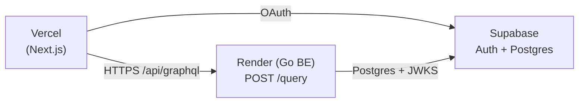

# Production deployment

Manual bring-up guide for the production stack. Walk through this once when standing up a new environment from scratch; everyday redeploys (push to `main`) do not require these steps.

The stack splits across three providers, each owning a distinct concern:

| Provider | Owns |
|---|---|
| Supabase | Postgres + Auth (JWT issuer, JWKS) |
| Render | Go / Echo backend (`backend/`) |
| Vercel | Next.js frontend (`frontend/`) |

## Guided bring-up via `make setup-prod`

A thin Ansible-driven layer wraps this manual runbook with prerequisite checks, value-derivation, GitHub Secret registration, deploy-trigger, and smoke tests. It does **not** replace the dashboard work below — operators still create the Supabase project, the Render web service, and the Vercel project by hand.

```bash
make setup-prod              # full guided run: preflight + 4 dashboard steps + smoke
make setup-prod-preflight    # ~10s scanner: tokens + GitHub App installs only
make setup-prod-postapply    # re-runnable: kick first Render deploy + smoke tests
```

The playbooks live under `playbooks/setup-prod/` and persist collected values (project refs, service IDs, URLs, anon key, DB DSN) into the gitignored `.setup-prod.state.yml` (mode 0600) for re-runs. The remainder of this document is the authoritative manual procedure; refer to it for what each phase is doing under the hood.

## Topology



The browser only ever talks to its own Vercel origin. `frontend/next.config.ts` rewrites `/api/graphql` → `${BACKEND_URL}/query`, so requests reach Render through Next's rewrite — there is no CORS layer on the backend (see `docs/frontend.md` § "Backend rewrite contract").

The backend trusts Supabase as the JWT issuer: it fetches the JWKS at boot from `SUPABASE_JWKS_URL` and validates `aud` / `iss` against `SUPABASE_JWT_AUDIENCE` / `SUPABASE_JWT_ISSUER` (see `docs/backend.md` § "Authentication"). Supabase is therefore the single trust anchor between Vercel and Render.

## Manual prerequisites

A few things must be set up out-of-band before standing up the providers.

### 1. Render GitHub App installation

Render needs read access to the repository:

1. `https://dashboard.render.com/select-repo` → **Configure account**.
2. Choose the GitHub account / org owning `yasuflatland-lf/flamingo-armond`.
3. Either grant access to all repos or just this one.
4. Confirm.

If you skip this, creating the Render web service fails with a 4xx because the GitHub App cannot reach the repo.

### 2. Vercel GitHub App installation

Same idea on Vercel:

1. `https://vercel.com/new` → **Import Git Repository**.
2. If `yasuflatland-lf` is not listed, click **Adjust GitHub App Permissions** and grant access.
3. Cancel the import wizard if you only need to install the app — you will trigger the actual import in Step 3 below.

### 3. Google Cloud Console OAuth Client

Supabase delegates Google sign-in to a Google OAuth client. It must be created on the Google Cloud side. This client is **separate from the local-dev OAuth client** in `docs/dev-setup.md` § "Supabase CLI": local credentials live in `frontend/.env.local`, production credentials live on the Google client itself, so a leaked local secret never affects production.

1. Open `https://console.cloud.google.com/apis/credentials`. Pick or create a project (this is the Google Cloud project, distinct from the Supabase project).
2. **Configure OAuth consent screen** if not yet done. Type **External**. Set product name and support email.
3. **Create Credentials → OAuth client ID** → Application type **Web application**. Name something like `flamingo-armond-prod`.
4. **Authorized redirect URIs** — add a placeholder for now:

   ```
   https://placeholder.supabase.co/auth/v1/callback
   ```

   The real Supabase project ref is unknown until the Supabase project is created in Step 1 below. After that, replace the placeholder with the actual ref (see "Post-bring-up tasks").
5. **Create**. Copy the Client ID and secret — you will paste them into Supabase Auth in the next section.

## Bring-up procedure

Four steps across the three providers. Allow about 30 minutes total; Supabase project provisioning is the slow leg (~5–15 minutes).

### Step 1 — Supabase

1. Create a new Supabase project (record region and DB password). Region matters for latency — keep it close to the Render region (the local default elsewhere in this repo is `ap-northeast-1`).
2. **Authentication → Sign In / Up**: enable Google OAuth. Paste the Client ID and secret from Manual prerequisites § 3.
3. Capture the values that other providers need:

   | Used as | Value | Where to find it in the dashboard |
   |---|---|---|
   | Frontend `NEXT_PUBLIC_SUPABASE_URL` | `https://<project-ref>.supabase.co` | **Data API** page, or assemble from **General → Project ID**. |
   | Frontend `NEXT_PUBLIC_SUPABASE_ANON_KEY` | Publishable key (preferred) or legacy anon key | **API Keys → Publishable and secret API keys** tab → **Publishable key** `default` row. **Never** copy from **Secret keys** or the legacy `service_role` row. |
   | Backend `SUPABASE_JWKS_URL` | `https://<project-ref>.supabase.co/auth/v1/.well-known/jwks.json` | **JWT Keys → Discovery URL**. |
   | Backend `SUPABASE_JWT_ISSUER` | `https://<project-ref>.supabase.co/auth/v1` | Assemble from project ref. |
   | Backend `SUPABASE_JWT_AUDIENCE` | `authenticated` | Supabase default. |

4. **Connect** (top of any page) → **Session pooler** tab → copy the `postgres://...?sslmode=require` DSN → backend `SUPABASE_DB_URL`. Use session pooler, not transaction pooler — `golang-migrate` issues advisory locks that need a real session.

### Step 2 — Render

Create a web service against `yasuflatland-lf/flamingo-armond`:

| Setting | Value |
|---|---|
| Root directory | `backend` |
| Build command | `go mod download && go build -o main ./cmd/server` |
| Start command | `./main` |
| Health check path | `/health` |
| Auto deploy | **off** — deploys are push-triggered via the deploy hook (see `.github/workflows/backend.yml`), not Render's auto-deploy. Schema migrations run on boot, so we tie deploys to explicit pushes. |

Set the env vars listed below.

| Variable | Value |
|---|---|
| `SUPABASE_DB_URL` | Session-mode pooler DSN from Step 1.4. |
| `SUPABASE_JWKS_URL` | `https://<project-ref>.supabase.co/auth/v1/.well-known/jwks.json` |
| `SUPABASE_JWT_AUDIENCE` | `authenticated` |
| `SUPABASE_JWT_ISSUER` | `https://<project-ref>.supabase.co/auth/v1` |
| `APP_ENV` | `production` |
| `GRAPHQL_INTROSPECTION` | `off` |
| `OTEL_TRACES_SAMPLER_ARG` | `0.1` |
| `OTEL_EXPORTER_OTLP_ENDPOINT` | OTLP endpoint, or empty for no-op tracing. |

After the service is created, copy the deploy hook URL from **Settings → Deploy Hook** and store it as the GitHub Actions secret `RENDER_DEPLOY_HOOK_URL` (used by `.github/workflows/backend.yml`).

### Step 3 — Vercel

Import the repo with **Root Directory: `frontend`**, framework **Next.js**. Add env vars:

| Variable | Scope | Value |
|---|---|---|
| `BACKEND_URL` | Production / Preview | Render service URL from Step 2. |
| `NEXT_PUBLIC_SUPABASE_URL` | All | `https://<project-ref>.supabase.co` |
| `NEXT_PUBLIC_SUPABASE_ANON_KEY` | All | Publishable key from Step 1.3. |

### Step 4 — Loop back to Supabase

1. **Authentication → URL Configuration** → set **Site URL** to the Vercel production URL and add `<vercel-domain>/auth/callback` to **Redirect URLs**.
2. In Google Cloud Console, replace the redirect URI placeholder from Manual prerequisites § 3 with the real `https://<project-ref>.supabase.co/auth/v1/callback`.

If you skip step 2, Google sign-in completes but redirects to the placeholder URL and fails.

## Post-bring-up tasks

### Trigger the first Render deploy

Auto-deploy is off so schema migrations stay tied to explicit deploys. Trigger the first deploy manually:

- Render dashboard → service → **Manual Deploy → Deploy latest commit**, or
- Push any commit to `main` (CI fires the deploy hook).

`golang-migrate` runs the schema migrations during the first boot.

### Trigger the first Vercel deploy

Push to `main`, or use the Vercel dashboard's **Deploy** button on the project page.

## Smoke tests after the initial setup

Replace `<backend-url>` and `<frontend-url>` with the URLs printed by Render and Vercel.

```bash
# Backend health
curl "<backend-url>/health"                              # → 200

# Backend GraphQL (auth-free query)
curl -X POST "<backend-url>/query" \
  -H 'content-type: application/json' \
  -d '{"query":"{ health }"}'                            # → {"data":{"health":"ok"}}

# Frontend reachability
curl -I "<frontend-url>"                                 # → 200
```

For an end-to-end check, sign in via Google on the Vercel domain and load `/profile`. The page issues an authenticated `me` query through the rewrite, which exercises the full Vercel → Render → Supabase chain (see `docs/frontend.md` § "Profile page").

## Operational gotchas

- **Migrations run on every Render boot.** A failing migration sets `schema_migrations.dirty=true` and requires manual `migrate force <version>` recovery (`docs/backend.md` § "Migrations").
- **Use `127.0.0.1`, not `localhost`, for any local OAuth setup.** Google's redirect URI validation treats them as distinct origins. This applies to local development only; production uses real domains (`docs/dev-setup.md` § "Gotchas").
- **Render free tier sleeps idle services.** The first request after idleness incurs a cold start. Health checks on `/health` keep the service warm only while traffic flows.
- **Custom domains.** When adding a Vercel custom domain, also update the Supabase Auth Site URL and add the new origin to the Redirect URLs allow list.
