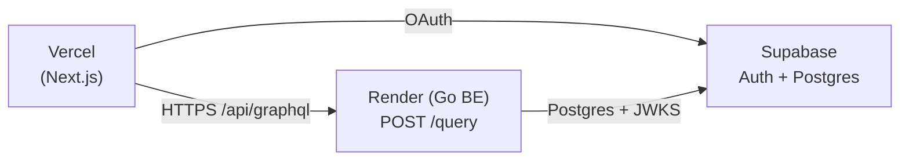

# Initial production setup

One-time bring-up guide for the production stack. Follow this once when standing up a new environment from scratch; everyday redeploys do not require these steps.

The stack splits across three providers. Each owns a distinct concern, and the source of truth is Terraform under `ops/terraform/`. Vercel and Supabase production settings still live in their respective dashboards but are reconciled to the Terraform state on each apply.

| Provider | Owns | Configuration source of truth |
|---|---|---|
| Supabase | Postgres + Auth (JWT issuer, JWKS) | `ops/terraform/modules/supabase/`. `supabase/config.toml` is for **local** CLI only. |
| Render | Go / Echo backend (`backend/`) | `ops/terraform/modules/render/`. |
| Vercel | Next.js frontend (`frontend/`) | `ops/terraform/modules/vercel/`. No `vercel.json` — Next.js 16 is zero-config here. |

## Topology



The browser only ever talks to its own Vercel origin. `frontend/next.config.ts` rewrites `/api/graphql` → `${BACKEND_URL}/query`, so requests reach Render through Next's rewrite — there is no CORS layer on the backend (see `docs/frontend.md` § "Backend rewrite contract").

The backend trusts Supabase as the JWT issuer: it fetches the JWKS at boot from `SUPABASE_JWKS_URL` and validates `aud` / `iss` against `SUPABASE_JWT_AUDIENCE` / `SUPABASE_JWT_ISSUER` (see `docs/backend.md` § "Authentication"). Supabase is therefore the single trust anchor between Vercel and Render.

## Bring-up order

A single `terraform apply` from `ops/terraform/envs/prod/` covers steps 1–4. The DAG resolves to a straight line because `supabase_project` and `supabase_settings` are split into separate resources:

```
supabase_project
  ├─→ render_web_service        (consumes db_url, jwks, issuer, audience)
  └─→ vercel_project            (consumes anon_key, project_url, render service_url)
        └─→ supabase_settings   (consumes vercel.production_url for site_url and redirect allow list)
```

Each provider can be redeployed independently afterwards. Subsequent code pushes only require a redeploy on the affected provider; the cross-provider wiring above is a one-time exercise that Terraform records in state.

## Manual prerequisites

A few things cannot be Terraformed because they require human consent flows or live in another platform's domain. Collect these once before running `terraform apply`.

### 1. Tools

Install Terraform 1.14.9 via `mise`:

```bash
cd ops/terraform
mise install
mise trust
```

### 2. Supabase Personal Access Token

`https://supabase.com/dashboard/account/tokens` → **Generate new token**. Store as `TF_VAR_supabase_access_token`.

### 3. Supabase Organization ID

```bash
curl -s -H "Authorization: Bearer $SUPABASE_PAT" \
  https://api.supabase.com/v1/organizations | jq
```

Pick the org that should own the new project. Store as `TF_VAR_supabase_organization_id`.

### 4. Render API Key + Owner ID

- API key: `https://dashboard.render.com/u/settings#api-keys` → **Create API Key**. Store as `TF_VAR_render_api_key`.
- Owner ID:

  ```bash
  curl -s -H "Authorization: Bearer $RENDER_API_KEY" \
    https://api.render.com/v1/owners | jq '.[].owner | {id, name, type}'
  ```

  Store as `TF_VAR_render_owner_id`.

### 5. Vercel API Token + Team ID

- Token: `https://vercel.com/account/tokens` → **Create**. Scope to the team if applicable. Store as `TF_VAR_vercel_api_token`.
- Team ID: leave `TF_VAR_vercel_team_id` blank for personal accounts. For a team, copy the team slug or ID from `https://vercel.com/<team>/~/settings`.

### 6. Render GitHub App installation

Render needs read access to the repository. The Terraform provider cannot perform this consent flow — do it once via the UI:

1. `https://dashboard.render.com/select-repo` → **Configure account**.
2. Choose the GitHub account / org owning `yasuflatland-lf/flamingo-armond`.
3. Either grant access to all repos or just this one.
4. Confirm. The next `terraform apply` will succeed in reading the repo.

If you skip this, the apply fails with a 4xx when creating `render_web_service` because the GitHub App cannot reach the repo.

### 7. Vercel GitHub App installation

Same idea on Vercel:

1. `https://vercel.com/new` → **Import Git Repository**.
2. If `yasuflatland-lf` is not listed, click **Adjust GitHub App Permissions** and grant access.
3. Cancel the import wizard — you only needed the install. Terraform creates the project.

### 8. Google Cloud Console OAuth Client

Supabase delegates Google sign-in to a Google OAuth client. It must be created on the Google Cloud side:

1. Open `https://console.cloud.google.com/apis/credentials`. Pick or create a project (this is the Google Cloud project, distinct from the Supabase project).
2. **Configure OAuth consent screen** if not yet done. Type **External**. Set product name and support email.
3. **Create Credentials → OAuth client ID** → Application type **Web application**. Name something like `flamingo-armond-prod`.
4. **Authorized redirect URIs** — add a placeholder for now:

   ```
   https://placeholder.supabase.co/auth/v1/callback
   ```

   The real Supabase project ref is unknown until the first `terraform apply`. After apply, replace the placeholder with the actual ref (see "Post-apply tasks" below).
5. **Create**. Copy **Client ID** to `TF_VAR_google_oauth_client_id` and **Client secret** to `TF_VAR_google_oauth_client_secret`.

## Initial bring-up

```bash
# 1. Provide secrets.
cp ops/terraform/mise.local.example.toml ops/terraform/envs/prod/mise.local.toml
$EDITOR ops/terraform/envs/prod/mise.local.toml   # fill in 8 values

# 2. Apply.
cd ops/terraform/envs/prod
terraform init
terraform plan
terraform apply
```

Apply takes roughly 10–15 minutes (Supabase project provisioning is the slow leg). On success, capture the outputs:

```bash
terraform output                                  # production_url, backend_url, supabase_project_*
terraform output -raw supabase_db_password        # generated value, store in your password manager
```

### Migrating from an existing manually-created Supabase project

If a Supabase project was already created by hand, **delete it first** in the Supabase dashboard before running `terraform apply`. Reasons:

- Terraform's `supabase_project` resource creates a new project with a Terraform-managed DB password. Importing an existing project does not capture the original password (Supabase only exposes it at creation), so an import path leaves Terraform unable to rotate or expose the credential.
- The new project gets a fresh `<project-ref>`. The frontend and backend pick this up automatically through the Terraform outputs.

This is safe to do during initial bring-up because no production user data exists yet.

## Post-apply tasks

Three things finish off the bring-up after the first apply lands.

### Update the Google OAuth client redirect URI

Replace the placeholder redirect URI from prerequisite step 8 with the real one:

```bash
ref=$(terraform output -raw supabase_project_ref)
echo "Set Authorized redirect URI to: https://${ref}.supabase.co/auth/v1/callback"
```

Open `https://console.cloud.google.com/apis/credentials`, edit the OAuth client, and replace the placeholder with the value above. Save.

If you skip this, Google sign-in completes but redirects to the placeholder URL and fails.

### Trigger the first Render deploy

`render_web_service` is created with `auto_deploy = false` so schema migrations stay tied to explicit deploys. The first deploy must be triggered manually:

- Render dashboard → service → **Manual Deploy → Deploy latest commit**, or
- `curl -X POST -H "Authorization: Bearer $RENDER_API_KEY" https://api.render.com/v1/services/$(terraform output -raw render_service_id)/deploys`.

`golang-migrate` runs the schema migrations during the first boot.

### Trigger the first Vercel deploy

The Vercel project resource creates the project but does not produce a deployment until a git push or a manual trigger. Push to `main`, or use the Vercel dashboard's **Deploy** button on the project page.

## Smoke tests after the initial setup

```bash
# Backend health
curl "$(terraform output -raw backend_url)/health"     # → 200

# Backend GraphQL (auth-free query)
curl -X POST "$(terraform output -raw backend_url)/query" \
  -H 'content-type: application/json' \
  -d '{"query":"{ health }"}'                          # → {"data":{"health":"ok"}}

# Frontend reachability
curl -I "$(terraform output -raw production_url)"      # → 200
```

For an end-to-end check, sign in via Google on the Vercel domain and load `/profile`. The page issues an authenticated `me` query through the rewrite, which exercises the full Vercel → Render → Supabase chain (see `docs/frontend.md` § "Profile page").

## Operational gotchas

- **Bring-up order matters.** The Terraform DAG enforces it — Render and Vercel both depend on Supabase outputs, and Supabase Auth settings depend on Vercel. A one-shot `apply` is the right order; do not target individual modules unless recovering from a partial failure.
- **DB password is generated by Terraform.** It lives in `terraform.tfstate` (gitignored) and is exposed via `terraform output -raw supabase_db_password`. To rotate, `terraform taint random_password.db` (inside the supabase module) and re-apply.
- **Migrations run on every Render boot.** A failing migration sets `schema_migrations.dirty=true` and requires manual `migrate force <version>` recovery (`docs/backend.md` § "Migrations"). Terraform does not manage schema.
- **Use `127.0.0.1`, not `localhost`, for any local OAuth setup.** Google's redirect URI validation treats them as distinct origins. This applies to local development only; production uses real domains (`docs/dev-setup.md` § "Gotchas").
- **Render free tier sleeps idle services.** The first request after idleness incurs a cold start. Health checks on `/health` keep the service warm only while traffic flows.
- **State is the only IaC source of truth.** Manual mutations in any provider's dashboard get reverted on the next `terraform apply`. If a UI change is genuinely needed, mirror it in `ops/terraform/` first.

## Manual fallback (legacy procedure)

If Terraform is unusable for some reason (provider outage, severely broken state), the following manual procedure mirrors what the modules do. Use only as a last resort — it loses the IaC guarantees.

### Step 1 — Supabase

1. Create a new Supabase project (record region and DB password).
2. **Authentication → Sign In / Up**: enable Google OAuth. In Google Cloud Console, register an OAuth client with redirect URI `https://<project-ref>.supabase.co/auth/v1/callback`.
3. Capture the values that other providers need:

   | Used as | Value | Where to find it in the dashboard |
   |---|---|---|
   | Frontend `NEXT_PUBLIC_SUPABASE_URL` | `https://<project-ref>.supabase.co` | **Data API** page, or assemble from **General → Project ID**. |
   | Frontend `NEXT_PUBLIC_SUPABASE_ANON_KEY` | Publishable key (preferred) or legacy anon key | **API Keys → Publishable and secret API keys** tab → **Publishable key** `default` row. **Never** copy from **Secret keys** or the legacy `service_role` row. |
   | Backend `SUPABASE_JWKS_URL` | `https://<project-ref>.supabase.co/auth/v1/.well-known/jwks.json` | **JWT Keys → Discovery URL**. |
   | Backend `SUPABASE_JWT_ISSUER` | `https://<project-ref>.supabase.co/auth/v1` | Assemble from project ref. |
   | Backend `SUPABASE_JWT_AUDIENCE` | `authenticated` | Supabase default. |

4. **Connect** (top of any page) → **Session pooler** tab → copy the `postgres://...?sslmode=require` DSN → backend `SUPABASE_DB_URL`. Use session pooler, not transaction pooler — `golang-migrate` issues advisory locks that need a real session.

### Step 2 — Render

Create a web service against `yasuflatland-lf/flamingo-armond` with `rootDir: backend`, `buildCommand: go mod download && go build -o main ./cmd/server`, `startCommand: ./main`, `healthCheckPath: /health`. Set the env vars listed below. Disable auto-deploy.

| Variable | Value |
|---|---|
| `SUPABASE_DB_URL` | Session-mode pooler DSN. |
| `SUPABASE_JWKS_URL` | `https://<project-ref>.supabase.co/auth/v1/.well-known/jwks.json` |
| `SUPABASE_JWT_AUDIENCE` | `authenticated` |
| `SUPABASE_JWT_ISSUER` | `https://<project-ref>.supabase.co/auth/v1` |
| `APP_ENV` | `production` |
| `GRAPHQL_INTROSPECTION` | `off` |
| `OTEL_TRACES_SAMPLER_ARG` | `0.1` |
| `OTEL_EXPORTER_OTLP_ENDPOINT` | OTLP endpoint, or empty for no-op tracing. |

### Step 3 — Vercel

Import the repo with **Root Directory: `frontend`**, framework **Next.js**. Add env vars:

| Variable | Scope | Value |
|---|---|---|
| `BACKEND_URL` | Production / Preview | Render service URL. |
| `NEXT_PUBLIC_SUPABASE_URL` | All | `https://<project-ref>.supabase.co` |
| `NEXT_PUBLIC_SUPABASE_ANON_KEY` | All | Publishable key from Step 1. |

### Step 4 — Loop back to Supabase

`Authentication → URL Configuration` → set Site URL and add `<vercel-domain>/auth/callback` to redirect URLs. In Google Cloud Console, replace the redirect URI placeholder with the real `https://<project-ref>.supabase.co/auth/v1/callback`.
