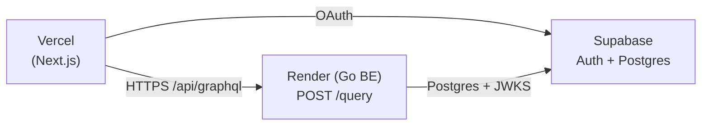

# Initial production setup

One-time bring-up guide for the production stack. Follow this once when standing up a new environment from scratch; everyday redeploys do not require these steps.

The stack splits across three providers. Each owns a distinct concern, and the only repository-tracked configuration is `render.yaml` (backend). Vercel and Supabase production settings live in their respective dashboards.

| Provider | Owns | Configuration source of truth |
|---|---|---|
| Supabase | Postgres + Auth (JWT issuer, JWKS) | Supabase dashboard (production project). `supabase/config.toml` is for **local** CLI only. |
| Render | Go / Echo backend (`backend/`) | `render.yaml` at the repo root, plus the Render dashboard for `sync: false` secrets. |
| Vercel | Next.js frontend (`frontend/`) | Vercel dashboard. No `vercel.json` — Next.js 16 is zero-config here. |

## Topology



The browser only ever talks to its own Vercel origin. `frontend/next.config.ts` rewrites `/api/graphql` → `${BACKEND_URL}/query`, so requests reach Render through Next's rewrite — there is no CORS layer on the backend (see `docs/frontend.md` § "Backend rewrite contract").

The backend trusts Supabase as the JWT issuer: it fetches the JWKS at boot from `SUPABASE_JWKS_URL` and validates `aud` / `iss` against `SUPABASE_JWT_AUDIENCE` / `SUPABASE_JWT_ISSUER` (see `docs/backend.md` § "Authentication"). Supabase is therefore the single trust anchor between Vercel and Render.

## Bring-up order

The order is load-bearing because the backend fails to boot when JWKS is unreachable (`NoErrorReturnFirstHTTPReq=false`, `docs/backend.md` § "JWKS lifecycle"). Provision dependencies first:

1. **Supabase** — create the project, capture URL / keys / DB DSN.
2. **Render** — inject the Supabase values into the backend service, deploy, capture the public URL.
3. **Vercel** — set `BACKEND_URL` to the Render URL, set the Supabase public env vars, deploy.
4. **Loop back to Supabase** — register the Vercel production domain in Auth → URL Configuration so OAuth redirects resolve.

After step 4, each provider can be redeployed independently. Subsequent code pushes only require a redeploy on the affected provider; the cross-provider wiring above is a one-time exercise.

## Step 1 — Supabase

Production settings live entirely in the Supabase dashboard. The committed `supabase/config.toml` mirrors what `supabase start` runs locally and does **not** apply to the production project.

1. Create a new Supabase project (record region and DB password).
2. **Authentication → Providers**: enable Google OAuth (mirror the providers configured locally in `supabase/config.toml`). In Google Cloud Console, register a separate OAuth client for production with redirect URI `https://<project-ref>.supabase.co/auth/v1/callback`.
3. **Project Settings → API**: capture the values that other providers need.

   | Source field | Used as |
   |---|---|
   | `Project URL` | Frontend `NEXT_PUBLIC_SUPABASE_URL` |
   | `anon public key` | Frontend `NEXT_PUBLIC_SUPABASE_ANON_KEY` |
   | `https://<ref>.supabase.co/auth/v1/.well-known/jwks.json` | Backend `SUPABASE_JWKS_URL` |
   | `https://<ref>.supabase.co/auth/v1` | Backend `SUPABASE_JWT_ISSUER` |
   | `authenticated` (Supabase default audience) | Backend `SUPABASE_JWT_AUDIENCE` |

4. **Database → Connection string → Session mode (port 5432)**: copy the `postgres://...?sslmode=require` DSN → backend `SUPABASE_DB_URL`.
5. The Vercel domain is not known yet; revisit Auth → URL Configuration in step 4 below once Vercel has been deployed.

Schema migrations are applied automatically by the backend at boot via `golang-migrate` (`docs/backend.md` § "Migrations"). Do **not** create tables manually in the Supabase dashboard — the migration files under `backend/internal/database/migrations/` are authoritative.

## Step 2 — Render (backend)

`render.yaml` declares the service. `autoDeploy: false` is intentional — deploys are triggered manually so schema migration runs are explicit.

Pre-set in `render.yaml`:

- `rootDir: backend` — Render only sees the `backend/` subtree.
- `buildCommand: go mod download && go build -o main ./cmd/server`
- `healthCheckPath: /health`
- Fixed values: `GRAPHQL_INTROSPECTION=off`, `APP_ENV=production`, `OTEL_TRACES_SAMPLER_ARG=0.1`.

Set in the Render dashboard (declared as `sync: false`):

| Variable | Value |
|---|---|
| `SUPABASE_DB_URL` | Session-mode Postgres DSN from Supabase. |
| `SUPABASE_JWKS_URL` | `https://<ref>.supabase.co/auth/v1/.well-known/jwks.json` |
| `SUPABASE_JWT_AUDIENCE` | `authenticated` (Supabase default). |
| `SUPABASE_JWT_ISSUER` | `https://<ref>.supabase.co/auth/v1` |
| `OTEL_EXPORTER_OTLP_ENDPOINT` | OTLP HTTP collector URL, or leave empty for no-op tracing (`docs/backend.md` § "Noop fallback"). |

Steps:

1. Render dashboard → **New → Blueprint** → point at the GitHub repository. Render reads `render.yaml` and creates the `flamingo-backend` service.
2. Open the service → **Environment** tab → fill in the `sync: false` values above.
3. **Manual Deploy → Deploy latest commit**.
4. Verify `GET /health` returns `200`. Capture the public URL (e.g. `https://flamingo-backend.onrender.com`) for the Vercel `BACKEND_URL`.

Notes:

- Render sends SIGTERM and SIGKILL after 30 s. `SHUTDOWN_TIMEOUT` defaults to 25 s; keep it under 30 s if customised (`docs/backend.md` § "Graceful shutdown contract").
- All four `SUPABASE_*` variables are required. The server fails fast at boot if any is missing or empty (`docs/backend.md` § "Environment variables").
- `GRAPHQL_INTROSPECTION=off` blocks `__schema` / `__type` queries in production but leaves the `/playground` UI loadable (`docs/backend.md` § "Introspection gating").

## Step 3 — Vercel (frontend)

Configuration lives entirely in the Vercel dashboard. Next.js 16 detects the build, and the pnpm version comes from the root `package.json` `packageManager` field via Corepack — no extra flags needed.

Steps:

1. Vercel → **Add New… → Project** → import the repository.
2. **Root Directory: `frontend`**. Framework preset: Next.js (auto-detected). Build / output settings: defaults.
3. **Environment Variables** (the table in `docs/frontend.md` § "Env vars" is canonical):

   | Variable | Scope | Value |
   |---|---|---|
   | `BACKEND_URL` | Production / Preview | Render service URL (e.g. `https://flamingo-backend.onrender.com`). Read at build time by `next.config.ts` and at runtime by the RSC `gqlFetch` helper. |
   | `NEXT_PUBLIC_SUPABASE_URL` | All | `https://<ref>.supabase.co` |
   | `NEXT_PUBLIC_SUPABASE_ANON_KEY` | All | Supabase anon key (public; RLS gates real access). |

4. Deploy. Capture the production domain for the next step.

Notes:

- `BACKEND_URL` is server-side only — it never enters the browser bundle. The browser always hits `/api/graphql` on its own origin (the Next rewrite in `frontend/next.config.ts` proxies to Render).
- Only env vars prefixed with `NEXT_PUBLIC_` are exposed to the client. Both Supabase variables in the table above are intentionally public.
- The middleware matcher excludes `/api/:path*` and `/auth/callback`. Without those exclusions, every GraphQL POST triggers a Supabase token-refresh round-trip (see `docs/frontend.md` § "Middleware cookie rotation").

## Step 4 — Loop back to Supabase

Now that the Vercel domain exists, finish the OAuth wiring:

1. **Supabase → Authentication → URL Configuration**:
   - Site URL → `https://<vercel-domain>`
   - Redirect URLs → add `https://<vercel-domain>/auth/callback`
2. In Google Cloud Console (the OAuth client created in step 1), add `https://<vercel-domain>` to Authorized JavaScript origins if Google sign-in is initiated from the browser.

Without this loop, OAuth callbacks land on the local development URL instead of production and silently fail.

## Smoke tests after the initial setup

```bash
# Backend health
curl https://<render-url>/health                      # → 200

# Backend GraphQL (auth-free query)
curl -X POST https://<render-url>/query \
  -H 'content-type: application/json' \
  -d '{"query":"{ health }"}'                         # → {"data":{"health":"ok"}}

# Frontend reachability
curl -I https://<vercel-domain>/                      # → 200
```

For an end-to-end check, sign in via Google on the Vercel domain and load `/profile`. The page issues an authenticated `me` query through the rewrite, which exercises the full Vercel → Render → Supabase chain (see `docs/frontend.md` § "Profile page").

## Operational gotchas

- **Bring-up order matters.** Render fails fast if Supabase is unreachable, because the JWKS fetch is mandatory at startup. Always provision Supabase first.
- **Migrations run on every Render boot.** A failing migration sets `schema_migrations.dirty=true` and requires manual `migrate force <version>` recovery (`docs/backend.md` § "Migrations").
- **Use `127.0.0.1`, not `localhost`, for any local OAuth setup.** Google's redirect URI validation treats them as distinct origins. This applies to local development only; production uses real domains (`docs/dev-setup.md` § "Gotchas").
- **Render free tier sleeps idle services.** The first request after idleness incurs a cold start. Health checks on `/health` keep the service warm only while traffic flows.
- **`render.yaml` is the only IaC artefact.** Vercel and Supabase production state is mutated by hand in their respective dashboards; document any manual change in the PR that depends on it.
